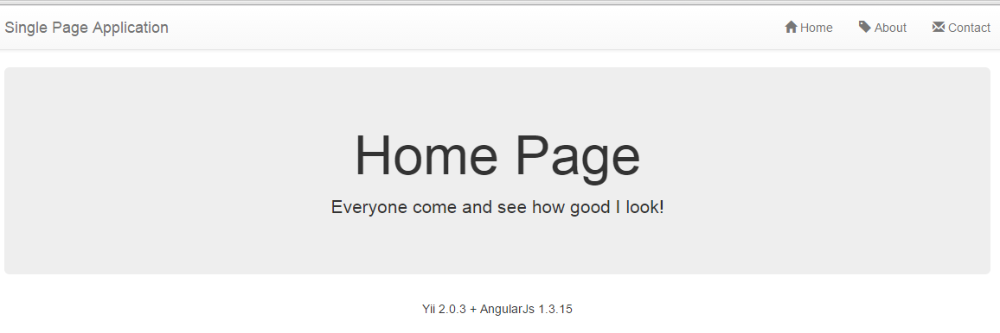
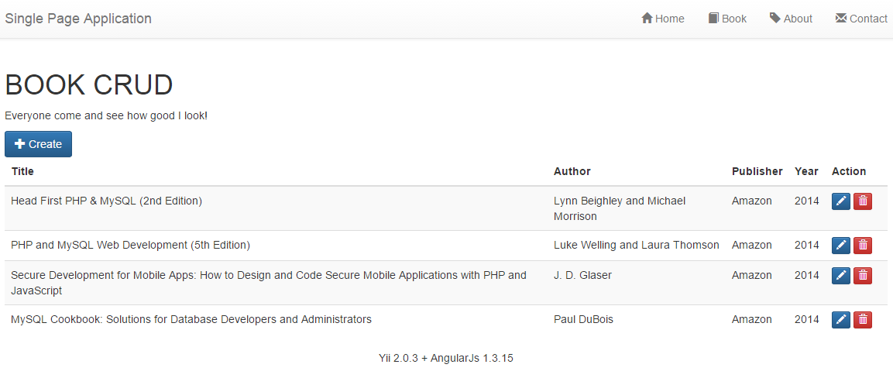

## Create Web Client

In this section we will create a web client , or the user interface of the web application service that has been created in the previous section . The technology that we will use is AngularJs as javascript frameworknya which is responsible for controlling web - client applications and the bootstrap is responsible for the look of the application.

### Setup Entry Script Application
Entry script is a script that was first accessed by our client web application , the [index.html](../web-client/index.html) file contained in the folder web - client.
#### Define Angular App
Attaching ng-app attribute to html tag. for example "spaApp"
```html
<!DOCTYPE html>
<!-- define angular app -->
<html ng-app="spaApp">
<head>
  <!-- CSS -->
```
#### Define Default Angular Controller
```html
Attaching ng-controller attribute to body tag. for example "index" controller
</head>
<!-- define angular controller -->
<body ng-controller="index">
```
#### Create Main Menu of Application 
Add this content inside body tag, its are Navbar for menu, main for page container, and footer
```html
<body ng-controller="index">
  <nav class="navbar navbar-default">
    <div class="container">
      <div class="navbar-header">
        <a class="navbar-brand" href="#/">Single Page Application</a>
      </div>	  
      <ul class="nav navbar-nav navbar-right">
        <li><a href="#/"><i class="glyphicon glyphicon-home"></i> Home</a></li>
        <li><a href="#/site/about"><i class="glyphicon glyphicon-tag"></i> About</a></li>
        <li><a href="#/site/contact"><i class="glyphicon glyphicon-envelope"></i> Contact</a></li>
      </ul>
    </div>
  </nav>
  <div id="main" class="container"> 
    <!-- angular templating -->
		<!-- this is where content will be injected -->
    <div ng-view></div>    
  </div>
  
  <footer class="text-center">
    <p>Yii 2.0.3 + AngularJs 1.3.15</p>
  </footer> 
```
Important thing of this code is in div tag id container.. 
```html
<div id="main" class="container"> 
  <!-- angular templating -->
	<!-- this is where content will be injected -->
  <div ng-view></div>    
</div>
```
<div ng-view></div>, in this div will placed the dynamic content from other file or page view.

### Create Main Module & Sub Module
The main module is intended to controll other javascript script for example sub module. We named him with [app.js](../web-client/app.js) and placed in the root of the web - client
```js
'use strict';
// adjust to the Your url of web service
var serviceBase = 'http://127.0.0.1/web-service/web/'
// Declare app level module which depends on views, and components
var spaApp = angular.module('spaApp', [
  'ngRoute',
  'spaApp.site',
]);
// sub module declaration
var spaApp_site = angular.module('spaApp.site', ['ngRoute'])

spaApp.config(['$routeProvider', function($routeProvider) {
  // config default route
  $routeProvider.otherwise({redirectTo: '/site/index'});
}]);
```
Default route is /site/index, this route will handled by sub module "spaApp.site"

### Create Definition of Sub Module
After create sub module spaApp.site, let us define what that sub module do. Create file [site.js](../web-client/controllers/site.js) in folder controllers. 
```js
'use strict';
spaApp_site.config(['$routeProvider', function($routeProvider) {
  $routeProvider
	.when('/site/index', {
		templateUrl: 'views/site/index.html',
		controller: 'index'
	})
	.when('/site/about', {
		templateUrl: 'views/site/about.html',
		controller: 'about'
	})
	.when('/site/contact', {
		templateUrl: 'views/site/contact.html',
		controller: 'contact'
	})
	.otherwise({
		redirectTo: '/site/index'
	});
}])
.controller('index', ['$scope', '$http', function($scope,$http) {
	// create a message to display in our view
	$scope.message = 'Everyone come and see how good I look!';
}])
.controller('about', ['$scope', '$http', function($scope,$http) {
	// create a message to display in our view
	$scope.message = 'Look! I am an about page.';
}])
.controller('contact', ['$scope', '$http', function($scope,$http) {
	// create a message to display in our view
	$scope.message = 'Contact us! JK. This is just a demo.';
}]);
```
This file is sub module to handle site views, maybe in Yii is like as SiteController.php. Please see this code..
```js
spaApp_site.config(['$routeProvider', function($routeProvider) {
  $routeProvider
	.when('/site/index', {
		templateUrl: 'views/site/index.html',
		controller: 'index'
	})
	...
	...
	.otherwise({
		redirectTo: '/site/index'
	});
}])
```
This is routing configuration of this sub module only. Every route have may templateUrl and controller. If You dont understand, I will analogize with Yii.
- TemplateUrl is other file html as partial content in Yii maybe same with views
- Controller is name of controller that do some process, for example set variable in template. in Yii maybe same with function of class controllers
if all routing is not met then it will be executed otherwise
```js
.controller('index', ['$scope', '$http', function($scope,$http) {
	// create a message to display in our view
	$scope.message = 'Everyone come and see how good I look!';
}])
```
$scope is scope that can be handled by the angular app in this case is all the tags under the tag which is marked with ng - app <html ng-app="spaApp">

$scope.message, message is variabel in file templateUrl, let say views/site/index.html, point to {{message}}
 
### Include Main Module and Sub Module
After create main module app.js and sub module site.js, we must include it in entry script of app [index.html](../web-client/index.html)
```html
  <script src="assets/angular/angular-animate.min.js"></script>
  <!-- Include this js -->
  <script src="app.js"></script>
  <script src="controllers/site.js"></script>
</body>
```
### Create Template File
Okey, after it then create template file that pointed by controller, okey create all file in [views](../web-client/views/) folder
- Create [site/index.html](../web-client/views/site/index.html)
```html
<div class="jumbotron text-center">
	<h1>Home Page</h1>
	
	<p>{{ message }}</p>
</div>
```
- Create [site/contact.html](../web-client/views/site/contact.html)
```html
<div class="jumbotron text-center">
	<h1>Contact Page</h1>
	
	<p>{{ message }}</p>
</div>
```
- Create [site/about.html](../web-client/views/site/about.html)
```html
<div class="jumbotron text-center">
	<h1>About Page</h1>
	
	<p>{{ message }}</p>
</div>
```
This is only simple example of views :)
 
### Testing Your Angular App Now
[http://localhost/web-client](http://localhost/web-client)<br>

 
### Modify app.js
Add js global varabel serviceBase that refer to Your Yii 2 web service, then add sub module spaApp.book
```js
'use strict';
var serviceBase = 'http://127.0.0.1/web-service/web/'
// Declare app level module which depends on views, and components
var spaApp = angular.module('spaApp', [
  'ngRoute',
  'spaApp.site',
  'spaApp.book',
]);
var spaApp_site = angular.module('spaApp.site', ['ngRoute'])
var spaApp_book = angular.module('spaApp.book', ['ngRoute']);

spaApp.config(['$routeProvider', function($routeProvider) {
  $routeProvider.otherwise({redirectTo: '/site/index'});
}]); 
```
### Create file [book.js](../web-client/models/book.js) in folder models
book.js will handle CRUD data from Rest Yii 2. I force You understand it as models in Yii 2 :)
```js
'use strict';
spaApp_book.factory("services", ['$http','$location','$route', 
	function($http,$location,$route) {
    var obj = {};
    obj.getBooks = function(){
        return $http.get(serviceBase + 'books');
    }	
	obj.createBook = function (book) {
		return $http.post( serviceBase + 'books', book )
			.then( successHandler )
			.catch( errorHandler );
		function successHandler( result ) {
			$location.path('/book/index');			
		}
		function errorHandler( result ){
			alert("Error data")
			$location.path('/book/create')
		}
	};	
	obj.getBook = function(bookID){
        return $http.get(serviceBase + 'books/' + bookID);
    }
	
	obj.updateBook = function (book) {
	    return $http.put(serviceBase + 'books/' + book.id, book )
			.then( successHandler )
			.catch( errorHandler );
		function successHandler( result ) {
			$location.path('/book/index');
		}
		function errorHandler( result ){
			alert("Error data")
			$location.path('/book/update/' + book.id)
		}	
	};	
	obj.deleteBook = function (bookID) {
	    return $http.delete(serviceBase + 'books/' + bookID)
			.then( successHandler )
			.catch( errorHandler );
		function successHandler( result ) {
			$route.reload();
		}
		function errorHandler( result ){
			alert("Error data")
			$route.reload();
		}	
	};	
    return obj;   
}]);
```
To understand it, so simple.. focus to function of objects: obj,getBooks, obj.createBook, etc. And in every function, there are process to point to RESTfull URL of Yii.. 

For example 
```js
obj.getBooks = function(){
        return $http.get(serviceBase + 'books');
    }
```
For get list of the book use method GET, see in [this guide](https://github.com/yiisoft/yii2/blob/master/docs/guide/rest-quick-start.md#trying-it-out-),

```js
obj.createBook = function (book) {
		return $http.post( serviceBase + 'books', book )
```
create book use method POST

```js
obj.updateBook = function (book) {
	    return $http.put(serviceBase + 'books/' + book.id, book )
```
update book use PUT method..

Okey, sos simple, do You understand now?

### Create Controller for Sub Module Site
Create file [book.js](../web-client/controllers/book.js) in folder controllers, is controller to handle book views, maybe in Yii is like as BookController.php
```js
'use strict';
spaApp_book.config(['$routeProvider', function($routeProvider) {
  $routeProvider
	.when('/book/index', {
		templateUrl: 'views/book/index.html',
		controller: 'index'
	})
	.when('/book/create', {
		templateUrl: 'views/book/create.html',
		controller: 'create',
		resolve: {
			book: function(services, $route){
				return services.getBooks();
			}
        }
	})
	.when('/book/update/:bookId', {
		templateUrl: 'views/book/update.html',
		controller: 'update',
		resolve: {
          book: function(services, $route){
            var bookId = $route.current.params.bookId;
            return services.getBook(bookId);
          }
        }
	})
	.when('/book/delete/:bookId', {
		templateUrl: 'views/book/index.html',
		controller: 'delete',
	})
	.otherwise({
		redirectTo: '/book/index'
	});
}]);

spaApp_book.controller('index', ['$scope', '$http', 'services', 
	function($scope,$http,services) {
	$scope.message = 'Everyone come and see how good I look!';
	services.getBooks().then(function(data){
        $scope.books = data.data;
    });	
	$scope.deleteBook = function(bookID) {
		if(confirm("Are you sure to delete book number: " + bookID)==true && bookID>0){
			services.deleteBook(bookID);	
			$route.reload();
		}
	};
}])
.controller('create', ['$scope', '$http', 'services','$location','book', 
	function($scope,$http,services,$location,book) {
	$scope.message = 'Look! I am an about page.';
	$scope.createBook = function(book) {
        var results = services.createBook(book);
    }  
}])
.controller('update', ['$scope', '$http', '$routeParams', 'services','$location','book', 
	function($scope,$http,$routeParams,services,$location,book) {
	$scope.message = 'Contact us! JK. This is just a demo.';
	var original = book.data;
	$scope.book = angular.copy(original);
	$scope.isClean = function() {
		return angular.equals(original, $scope.book);
	}
	$scope.updateBook = function(book) {	
        var results = services.updateBook(book);
    } 
}]);
```
Use Yii analogy to understand this code :)

### Create Template File of Sub Module Book
Create template file that pointed by controller at sub module book, okey create all file in [views](../web-client/views/) folder
- Create [book/index.html](../web-client/views/book/index.html)
```html
<div>
	<h1>BOOK CRUD</h1>	
	<p>{{ message }}</p>
	<div ng-show="books.length > 0">
	<a class="btn btn-primary" href="#/book/create">
		<i class="glyphicon glyphicon-plus"></i> Create
	</a>
	<table class="table table-striped table-hover">
	<thead>
	<th>Title</th>
	<th>Author</th>
	<th>Publisher</th>
	<th>Year</th>
	<th style="width:80px;">Action&nbsp;</th>
	</thead>
	<tbody>
		<tr ng-repeat="data in books">
			<td>{{data.title}}</td>
			<td>{{data.author}}</td>
			<td>{{data.publisher}}</td>
			<td>{{data.year}}</td>
			<td>
			<a class="btn btn-primary btn-xs" href="#/book/update/{{data.id}}">
				<i class="glyphicon glyphicon-pencil"></i>
			</a> 
			<a class="btn btn-danger btn-xs" ng-click="deleteBook(data.id)">
				<i class="glyphicon glyphicon-trash"></i>
			</a>
			</td>
		</tr>
	</tbody>
	</table>
	</div>
	<div ng-show="books.length == 0">
		Empty
	</div>
</div>
```
- Create [book/create.html](../web-client/views/book/create.html)
```html
<div>
	<h1>BOOK CRUD</h1>
	
	<p>{{ message }}</p>
	<form role="form" name="myForm">
		<div class= "form-group" ng-class="{error: myForm.title.$invalid}">
			<label> Title </label>
			<div>
			<input name="title" ng-model="book.title" type= "text" class= "form-control" placeholder="Title" required/>
			<span ng-show="myForm.title.$dirty && myForm.title.$invalid" class="help-inline">Title Required</span>
			</div>
		</div>
		<div class= "form-group">
			<label> Description </label>
			<div>
			<textarea name="description" ng-model="book.description" class= "form-control" placeholder= "Description"></textarea>
			</div>
		</div>
		<div class= "form-group" ng-class="{error: myForm.author.$invalid}">
			<label> Author </label>
			<div>
			<input name="author" ng-model="book.author" type= "text" class= "form-control" placeholder="Author" required/>
			<span ng-show="myForm.author.$dirty && myForm.author.$invalid" class="help-inline">Author Required</span>
			</div>
		</div>
		<div class= "form-group" ng-class="{error: myForm.publisher.$invalid}">
			<label> Publisher </label>
			<div>
			<input name="publisher" ng-model="book.publisher" type= "text" class= "form-control" placeholder="Publisher" required/>
			<span ng-show="myForm.publisher.$dirty && myForm.publisher.$invalid" class="help-inline">Publisher Required</span>
			</div>
		</div>
		<div class= "form-group" ng-class="{error: myForm.year.$invalid}">
			<label> Year </label>
			<div>
			<input name="year" ng-model="book.year" type= "text" class= "form-control" placeholder="Year" required/>
			<span ng-show="myForm.year.$dirty && myForm.year.$invalid" class="help-inline">Year Required</span>
			</div>
		</div>
	  
		<a href="#/book/index" class="btn btn-default">Cancel</a>
		<button ng-click="createBook(book);" 
                ng-disabled="myForm.$invalid"
                type="submit" class="btn btn-default">Submit</button>
	</form>
</div>
```
- Create [book/update.html](../web-client/views/book/update.html)
```html
<div>
	<h1>BOOK CRUD</h1>
	
	<p>{{ message }}</p>
	<form role="form" name="myForm">
		<div class= "form-group" ng-class="{error: myForm.title.$invalid}">
			<label> Title </label>
			<div>
			<input name="title" ng-model="book.title" type= "text" class= "form-control" placeholder="Title" required/>
			<span ng-show="myForm.title.$dirty && myForm.title.$invalid" class="help-inline">Title Required</span>
			</div>
		</div>
		<div class= "form-group">
			<label> Description </label>
			<div>
			<textarea name="description" ng-model="book.description" class= "form-control" placeholder= "Description"></textarea>
			</div>
		</div>
		<div class= "form-group" ng-class="{error: myForm.author.$invalid}">
			<label> Author </label>
			<div>
			<input name="author" ng-model="book.author" type= "text" class= "form-control" placeholder="Author" required/>
			<span ng-show="myForm.author.$dirty && myForm.author.$invalid" class="help-inline">Author Required</span>
			</div>
		</div>
		<div class= "form-group" ng-class="{error: myForm.publisher.$invalid}">
			<label> Publisher </label>
			<div>
			<input name="publisher" ng-model="book.publisher" type= "text" class= "form-control" placeholder="Publisher" required/>
			<span ng-show="myForm.publisher.$dirty && myForm.publisher.$invalid" class="help-inline">Publisher Required</span>
			</div>
		</div>
		<div class= "form-group" ng-class="{error: myForm.year.$invalid}">
			<label> Year </label>
			<div>
			<input name="year" ng-model="book.year" type= "text" class= "form-control" placeholder="Year" required/>
			<span ng-show="myForm.year.$dirty && myForm.year.$invalid" class="help-inline">Year Required</span>
			</div>
		</div>
	  
		<a href="#/book/index" class="btn btn-default">Cancel</a> 
		<button ng-click="updateBook(book);" 
                ng-disabled="isClean() || myForm.$invalid"
                type="submit" class="btn btn-default">Submit</button>
	</form>
</div>
```

### Testing now
 


---

> *** Done ***<br>
> [Back To Index](index.md) <br>
> [01. Introduction](01-introduction.md) <br> 
> [02. Preparation](02-preparation.md) <br>
> [03. Create Web Service](03-create-web-service.md) <br>
> [04. Create Web Client](04-create-web-client.md) <br>
> [05. Customization](05-customization.md) <br>
> [06. Conclusion](06-conclusion.md) <br>
